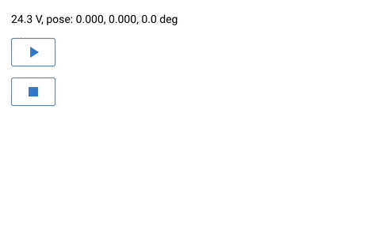

# Events

RoSys provides an integrated event bus to chain otherwise separated parts of the system together.
This allows loosely coupled actors where each one has its own dedicated role in a more complex workflow.
For example the Lizard actor repeatedly reads the current machine data like velocity, battery, ..., writes them into the world and finally fires the event `NEW_MACHINE_DATA`.
The Odometer actor has registered itself for this event to compute the new position of the robot.
Other actors may also register for the same event to monitor battery level or bump events.

## Example

Watching the battery level:

```python
{!watch_battery_level.py!}
```


