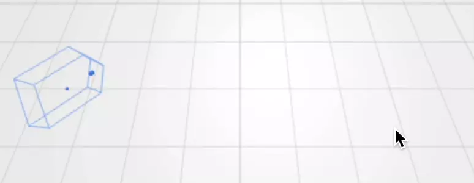

# Click-and-drive

In this example we create a simulated robot which uses an [automation](../../reference/rosys/automation.md) to drive wherever the user clicks.

```python
{! examples/click-and-drive/main.py !}
```

{: style="width:60%"}

Modules
: Besides wheels, odometer and a robot shape we need a driver that enables the robot to drive along a given path as well as an automator to start and stop such an automated behavior.

Click handler
: NiceGUI's 3D scene allows registering a click handler that can iterate through all hit points and find the target on the ground.

Driver
: Among others, the driver has an async method `drive_to` which lets the robot follow a straight line to a given target.

Automator and automation controls
: The [automator](../../reference/rosys/automation.md#rosys.automation.Automator) starts the async method and allows pausing, resuming and stopping it, e.g. with the `AutomationControls` UI element.
