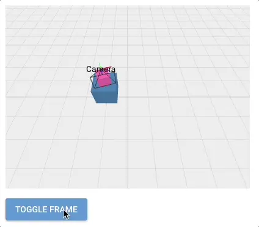

# Coordinate Frames

This example shows how to use `Pose3d` and `Frame3d` to represent objects that are connected to each other.
Here, we have a moving blue box and a rotating pink box with a camera attached to it.
The button allows switching the pink box between the blue box's frame and the world frame at runtime.
Note that the relationship between the pink box and the camera is unaffected by the frame switch.

```python
{! examples/coordinate-frames/main.py !}
```

{: style="width:80%"}

## Persistence

Frames are defined and accessed through an `id`. The `id` must be unique and is used lazily whenever a transformation is needed.
This `id` makes it possible to fully persist `Pose3d`, `Frame3d` and their relationships.
This can be useful for situation where exact relationships are calibrated at runtime (e.g. multi-camera calibration) or when a robot's axes are expected to be persistent across reboots.

For the second case, make sure that you know when the persistence overwrite happens (in the rosys startup handler) so that everything is loaded correctly.
See [examples/camera_arm](https://github.com/zauberzeug/rosys/tree/main/examples/camera_arm) for an example on that.
