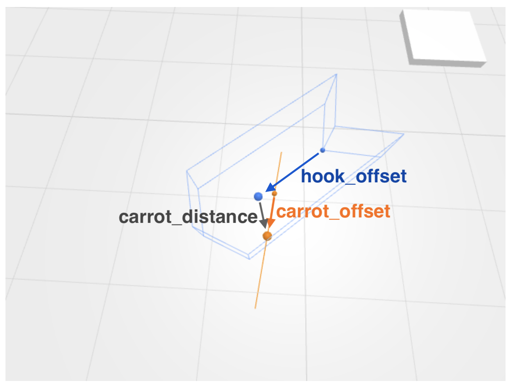

# Navigation

This example is similar to [Click-and-drive](../click-and-drive/README.md) but includes a `PathPlanner` to find a path around an obstacle.

```python
{! examples/navigation/main.py !}
```

### Path Following

When following a path, a "carrot" is dragged along a spline and the robot follows it like a donkey.
Additionally, there is a virtual "hook" attached to the robot, which is pulled towards the carrot.

There are three parameters:

- `hook_offset`: How far from the wheel axis (i.e. the coordinate center of the robot) is the hook, which is pulled towards the carrot.
- `carrot_offset`: How far _ahead of the carrot_ is the robot pulled. This parameter is necessary in order to have the hook pulled a bit further, even though the carrot already reached the end of the spline.
- `carrot_distance`: How long is the "thread" between hook and carrot (or the offset point _ahead_ of the carrot, respectively).

In the following illustration these points are depicted as spheres: the coordinate center of the robot (blue, small), the hook (blue, large), carrot (orange, small), offset point ahead of the carrot (orange, large).

{: style="width:60%"}

You can display a wire frame version of the robot by passing `debug=true` to the [`robot_object`](../../reference/rosys/driving.md#rosys.driving.robot_object).

!!! note

    The automation `drive_spline` has an optional argument `flip_hook`.
    It turns the hook 180 degrees to the back of the robot, while preserving the distance `hook_offset` to the robot's coordinate center.
    This allows the robot to drive backwards to a point behind it instead of turning around and approaching it forwards.

A more complex example can be found in the [RoSys GitHub repository](https://github.com/zauberzeug/rosys/tree/main/examples/obstacles).
There you can create new obstacles and choose between straight driving or navigation.
