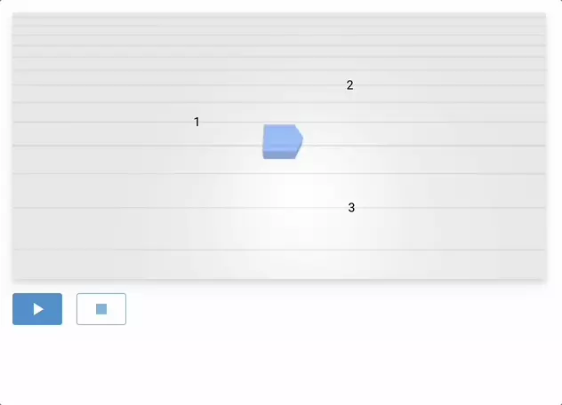

# Play-pause-stop

In this example, we use the `AutomationControls` UI element to start, pause and stop an automation.
Here we let the robot drive to predefined checkpoints one after the other.

```python
{! examples/play-pause-stop/main.py !}
```

To achieve this, we define our automation as an async method and pass it to the `default_automation` parameter of the `Automator`.

{: style="width:80%"}
