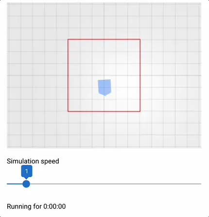

# Simulation Speed

When running in simulation you can accelerate the time.
Here we have set up a fence in which the robot moves to random positions.
With a simple slider the execution time is accelerated.
Note how the time advances faster if the simulation speed is increased.
The driving speed of the robot remains the same.

{: style="width:60%"}

You can activate time simulation by calling `rosys.enter_simulation()`
and adding the control UI to your page with `rosys.simulation_ui()`.
The rest of the code is needed to define the boundary, draw it in the 3D scene and start the automation for random movement:

```python hl_lines="30"
{! examples/simulation-speed/main.py !}
```
